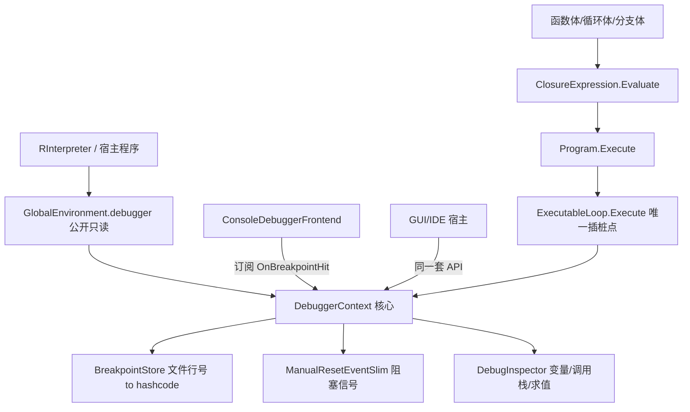

## 用户需求

为 VB.NET 编写的 R# 脚本解释器（模拟 GNU R）增加**调试器**能力，支持**单步调试**与**运行到指定断点**。

## 已确认的需求边界

1. **交互形态**：控制台交互 + 可嵌入宿主 API。核心采用「事件回调 + 阻塞信号量」，控制台前端只是核心之上的默认实现，不得把 Console 逻辑写死进核心。
2. **断点定位**：同时支持「文件名 + 行号」注册（对外主用）与内部 hashcode 匹配（对内高速命中）。
3. **单步范围**：完整覆盖，含 Step Over / Step Into / Step Out，需步入用户自定义函数与循环、分支体，并维护调用栈深度。
4. **检查能力**：查看当前作用域变量、查看调用栈、运行时求值任意表达式（watch / 立即窗口）、条件断点。

## 核心功能

- **执行控制**：Continue（运行到下一断点）、StepOver（同层下一句）、StepInto（进入被调用体）、StepOut（执行到当前层返回）、Stop（终止脚本）。
- **断点管理**：按 `文件 + 行号` 增删断点、启用/禁用、列出全部断点；支持条件断点（条件为真才中断）与命中计数。
- **暂停与恢复**：命中后真正阻塞执行线程，向宿主抛出暂停事件，等待宿主或控制台下达指令后恢复。
- **运行时检查**：列出当前作用域变量名与值、打印从当前帧到顶层的调用栈、在暂停点求值任意 R# 表达式。
- **控制台前端**：命中后展示当前源码行与位置，提供 c / n / s / o / q、`vars`、`bt`、`p <表达式>`、`break <文件:行>` 等命令。

## 视觉效果

控制台彩色分级输出：命中位置黄色高亮并标注 `文件:行号`，当前源码行前置 `=>` 指示符，变量列表与调用栈以对齐表格呈现，错误红色、提示灰色，与项目既有 `VBDebugger.WriteLine` 配色风格保持一致。

## 技术栈

沿用现有工程，不引入任何新依赖：

- **语言/框架**：VB.NET，`Rsharp-netcore5.vbproj`
- **既有基础设施**：`Microsoft.VisualBasic.ApplicationServices.Debugging.Diagnostics.StackFrame`（sciBASIC 外部程序集，含 `GetBreakpointHashCode`）、`VBDebugger.WriteLine` 彩色输出、`Environment.stackTrace`、`Environment.GetSymbolsNames`
- **并发原语**：`System.Threading.ManualResetEventSlim`（阻塞暂停模型）
- **代码风格**：新文件保留项目统一的 `#Region "Microsoft.VisualBasic::..."` 版权注释头

## 关键架构发现（已逐一读码验证）

**决定性发现：`ExecutableLoop.Execute` 是唯一的通用插桩点。**

`ClosureExpression.Evaluate`（`.../Turing/Closure/ClosureExpression.vb:115-137`）内部执行 `program.Execute(envir)`，而 `Program.Execute`（`Interpreter/Program.vb:106-108`）执行 `New ExecutableLoop().Execute(execQueue, envir)`。经核实，以下块体均为 `ClosureExpression`：

| 语法结构 | 字段声明位置 |
| --- | --- |
| `DeclareNewFunction.body` | `Closure/DeclareNewFunction.vb:147` |
| `WhileLoop.loopBody` | `Turing/WhileLoop.vb:87` |
| `IfBranch` / `ElseIfBranch` / `ElseBranch` | `Turing/If/*.vb:98/75/96` |
| `RepeatClosure.closure` | `Closure/RepeatClosure.vb:84` |
| `UsingClosure.closure` | `Closure/UsingClosure.vb:98` |
| `ForLoop.body` | `Turing/ForLoop.vb:95`（`DeclareNewFunction`，其 `body` 仍是 `ClosureExpression`） |


**结论**：所有函数体、循环体、分支体的语句执行都必然流经 `ExecutableLoop.Execute` 的 `For Each` 循环。因此**只需改造这一处**即可让单步/断点自动覆盖全部嵌套层级，无需逐个修改数十个表达式类。这是本方案避免大规模重写的核心依据。

## 现存缺陷（方案需逐条修复）

1. `DebuggerContext.Pause` 只 `RaiseEvent`，**并不阻塞**；`WaitForInput` 从未被调用 → 单步实际完全失效。
2. `Breakpoints As HashSet(Of Integer)` 存 hashcode，缺「文件+行号 → hashcode」映射与注册 API。
3. 无 `StepOut`；`StepOver` 语义实为「步进每条顶层语句」，未记录栈深度。
4. 未实现 `IRuntimeTrace` 的表达式 `GetBreakPointHashCode` 恒返回 0 → 不可作断点目标；部分语法构造器 `stackFrame.Line` 为 `"n/a"`。
5. `PrintVariables` 是空壳；无条件断点；无运行时求值入口。
6. `Environment.debugger`（`Environment.vb:166`）为 `Friend ReadOnly`，宿主不可访问。
7. `ExecutableLoop` 为并行（parLapply/parSapply）设计为实例类，而 `DebuggerContext` 沿环境链共享单例 → 并行下需禁用调试，避免多线程争用同一信号量。

## 实现策略

### 1. 阻塞暂停模型（前后端分离）

`Pause` 改为真正阻塞：置暂停状态 → `RaiseEvent OnBreakpointHit` 通知宿主 → `ManualResetEventSlim.Wait()` 阻塞执行线程 → 宿主/控制台调用 `Resume(action)` 设置动作并 `Set()` → 解除阻塞。

核心**不含任何 Console 代码**；控制台交互抽到 `ConsoleDebuggerFrontend`，通过订阅事件驱动，与 GUI 宿主共用同一套核心 API。

### 2. 断点定位：双层索引

对外 `AddBreakpoint(file, line, condition)`；内部对 `file+line` 做路径规范化（统一 `\`、转小写，与 sciBASIC `GetBreakpointHashCode` 口径一致）后建 `Dictionary(Of Integer, Breakpoint)`，命中时 O(1) 查表。`stackFrame.Line` 为 `"n/a"` 时解析失败则跳过匹配，注册期给出一次性告警，不影响执行。

### 3. Step Over / Into / Out：以栈深度判定

`ExecutableLoop.Execute` 入口 `depth += 1`、`Finally` 中 `depth -= 1`（因所有块体都经此方法，depth 天然等于块嵌套深度）：

- **StepInto**：任意 depth 均暂停
- **StepOver**：仅当 `depth <= 基准 depth` 时暂停（更深层是被调用体，直接跑完）
- **StepOut**：仅当 `depth < 基准 depth` 时暂停
- **Continue**：仅命中断点时暂停

用 `Try/Finally` 保证异常与 `return`/`break` 提前退出时深度不失衡。

### 4. 运行时求值与条件断点

复用既有链路：`Expression.Parse(script)` → `Evaluate(env)`，用 `Program.isException` 判错。条件断点在命中点先求值条件，非真则不中断；条件求值抛错时按「安全失败」中断并提示，避免静默吞掉问题。

### 5. 性能与影响面控制

- 未开启调试时（`IsDebugging = False`）**零额外开销**：热点循环内仅一次布尔判断，与现有 `showExpression` 同级；不改变非调试路径任何行为。
- 断点匹配 O(1) 字典查表；`depth` 为整型自增，可忽略。
- 并行执行下检测到非主线程时自动跳过暂停，规避共享信号量争用。
- `Environment.debugger` 保持 `Friend`，另在 `GlobalEnvironment` 暴露只读公开属性供宿主访问，避免放宽字段可见性扩散影响面。

## 架构设计



## 目录结构

```
R#/
├── Interpreter/
│   ├── Debugger/
│   │   ├── DebugAction.vb              # [MODIFY] 增加 StepOut 成员；补充各动作语义注释
│   │   ├── DebuggerContext.vb          # [MODIFY] 核心改造：Pause 改为 ManualResetEventSlim 真阻塞；
│   │   │                               #   新增 Resume(action)、栈深度 depth 与基准深度；
│   │   │                               #   ShouldPause 按 Over/Into/Out 深度语义重写；
│   │   │                               #   Breakpoints 由 HashSet 改为 BreakpointStore；
│   │   │                               #   移除空壳 PrintVariables 与 Console 耦合的 WaitForInput
│   │   ├── Breakpoint.vb               # [NEW] 断点模型：file、line、condition、enabled、hitCount；
│   │   │                               #   ToString 用于列表展示
│   │   ├── BreakpointStore.vb          # [NEW] 断点集合管理。按 文件+行号 增删查改，内部以
│   │   │                               #   Dictionary(Of Integer, Breakpoint) 按 hashcode 索引；
│   │   │                               #   负责路径规范化，与 sciBASIC 口径对齐
│   │   ├── DebugInspector.vb           # [NEW] 运行时检查器。列出作用域变量（复用 GetSymbolsNames/FindSymbol）、
│   │   │                               #   格式化调用栈（复用 Environment.stackTrace）、
│   │   │                               #   求值表达式（复用 Expression.Parse + Evaluate + Program.isException）
│   │   ├── DebugFrame.vb               # [NEW] 暂停点快照：表达式、环境、文件、行号、栈深度，
│   │   │                               #   作为事件参数传给宿主，避免宿主直接触碰内部状态
│   │   └── ConsoleDebuggerFrontend.vb  # [NEW] 控制台前端。订阅 OnBreakpointHit，展示命中位置与源码行，
│   │                                   #   解析 c/n/s/o/q、vars、bt、p <expr>、break <file:line>，
│   │                                   #   调用 Resume 恢复执行；核心逻辑零 Console 依赖
│   ├── ExecutableLoop.vb               # [MODIFY] 唯一插桩点。入口/Finally 维护栈深度；
│   │                                   #   现有调试块替换为 ShouldPause -> Pause(真阻塞) -> 处理 Stop；
│   │                                   #   并行/非主线程跳过调试；保持非调试路径零开销与 profiler 行为不变
│   └── ExecuteEngine/
│       └── Expression.vb               # [MODIFY] GetBreakPointHashCode 放宽可访问性，
│                                       #   补充获取 file/line 的辅助方法供断点索引与命中展示
├── Runtime/Environment/
│   └── GlobalEnvironment.vb            # [MODIFY] 新增公开只读属性暴露 DebuggerContext，
│                                       #   保持 Environment.debugger 原 Friend 可见性不变
└── test/
    └── debuggerTest.vb                 # [MODIFY] 改为真实用例：注册行号断点与条件断点，验证
                                        #   Continue/StepOver/StepInto/StepOut、变量、调用栈、表达式求值
```

## 关键接口设计

```
' 暂停点快照，作为事件参数传给宿主，隔离内部状态
Public Class DebugFrame
    Public ReadOnly Property expression As Expression
    Public ReadOnly Property environment As Environment
    Public ReadOnly Property file As String
    Public ReadOnly Property line As Integer
    Public ReadOnly Property depth As Integer
End Class

' 核心执行控制契约（宿主与控制台前端共用）
Public Class DebuggerContext
    Public Event OnBreakpointHit As Action(Of DebugFrame)

    Public Sub AddBreakpoint(file As String, line As Integer, Optional condition As String = Nothing)
    Public Sub RemoveBreakpoint(file As String, line As Integer)
    Public Function ListBreakpoints() As Breakpoint()

    ' 由执行线程调用，内部阻塞直到宿主 Resume
    Friend Sub Pause(frame As DebugFrame)
    ' 由宿主/前端线程调用，设置动作并唤醒执行线程
    Public Sub [Resume](action As DebugAction)
End Class
```

## Agent Extensions

### SubAgent

- **code-explorer**
- Purpose: 在改造 `ExecutableLoop` 前，全面排查项目内所有直接调用 `Program.Execute` / `ClosureExpression.Evaluate` 的旁路，确认无绕过插桩点的执行路径（尤其 `parLapply`/`parSapply` 并行分支与 `AcceptorClosure`）。
- Expected outcome: 输出完整调用点清单，确认插桩点唯一性，识别需跳过调试的并行路径。