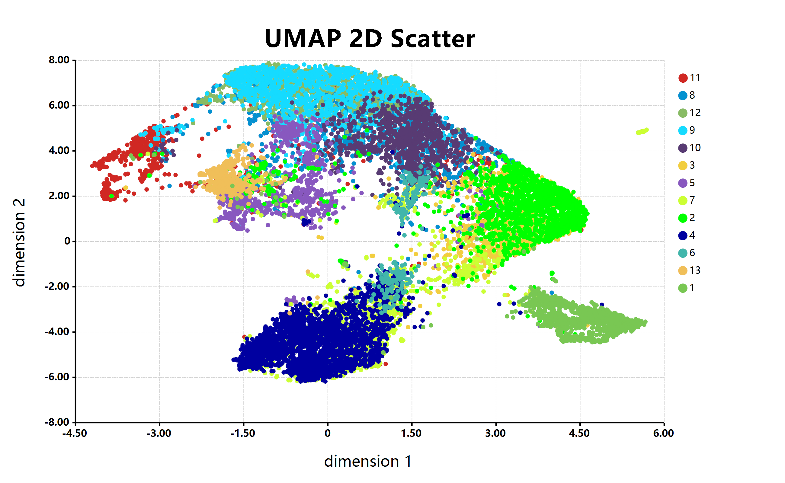

# ``R#`` language

R# language is a kind of R liked language implements on .NET environment for GCModeller scripting.

> [WARNING] This project is a work in progress and is not recommended for production use.


> Art work: http://www.clipartbest.com/clipart-di85MqodT

> The latest [sciBASIC.NET Framework](https://github.com/xieguigang/sciBASIC) runtime is also required

The ``R#`` language its syntax is original derived from the ``R`` language, but with more modernized programming styles. The ``R#`` language its interpreter and .NET compiler is original writen in VisualBasic language, with native support for the .NET runtime.

The ``R#`` language is not designed for the general data analysis purpose, but it is specialize designed for my works in the company, implements the bioinformatics data analysis system based on the GCModeller platform, for building the bioinformatics data science stack with R and VisualBasic language.

#### Directory structure

+ [``R#``](./R#) The R# language core runtime and scripting engine
+ [``Library``](./Library) The fundation library in R# scripting system
+ [``Rscript``](./Rscript) The R# scripting host
+ [``R-terminal``](./studio/R-terminal) The R# shell program  
+ [``Rsharp_kit``](./studio/Rsharp_kit) The R-sharp toolkit
+ [``njl``](./studio/njl) The Julia language liked scripting engine
+ [``npy``](./studio/npy) The Python language liked scripting engine
+ [``RData``](./studio/RData) The R language data ``*.rda/*.rds`` file reader

#### Demo R# code

```R
# declare a variable
let word as string = ['world', 'R# user', 'GCModeller user'];

# declare a function
let echo as function(words) {
    print( `Hello ${ words }!` );
}

# or declare a lambda function
let echo.lambda = words -> print( `Hello ${ words }!` );

# and then invoke function via pipeline operator
word :> echo;
# [3] "Hello world!" "Hello R# user!" "Hello GCModeller user!"
word :> echo.lambda;
# [3] "Hello world!" "Hello R# user!" "Hello GCModeller user!"
```

Used in VisualBasic.NET programming:

```vbnet
Dim R As New RInterpreter()

' Run script by invoke method
Call R.Evaluate("
    # test script
    let word as string = ['world', 'R# user', 'GCModeller user'];
    let echo as function(words) {
        print( `Hello ${ words }!` );
    }

    word :> echo;
")

' or assign variable
Call R.Add("word", {"world", "R# user", "GCModeller user"})

' then declare R function throught script
Call R.Add("echo", 
    Function(words As String()) As String()
        Return Internal.print(words)
    End Function)

' at last, invoke R function throught Invoke method
Call R.Invoke("echo", R!word)
```

## Graphics Library



```r
# read scatter point data from a given table file
# and then assign to tuple variables
[x, y, cluster] = read.csv("./scatter.csv", row.names = NULL);

# umap scatter with class colors
bitmap(file = "./scatter.png") {
	plot(x, y,
		 padding      = "padding:200px 400px 200px 250px;",
		 class        = cluster,
		 title        = "UMAP 2D Scatter",
		 x.lab        = "dimension 1",
		 y.lab        = "dimension 2",
		 legend.block = 13,
		 colorSet     = "paper", 
		 grid.fill    = "transparent",
		 size         = [2600, 1600]
	);
};
```

## Language Hybrids Programming Feature

The ``R#`` system is not only supports of the R liked language, it also includes a python language scripting and Julia language scripting engine which is running upon the ``R#`` runtime.

Reference of the python script or julia script in ``R#`` language just like imports other ``R#`` script:

```r
# imports an external R# script
imports "./script.R";
# imports an external python script in R#
imports "./script.py";
# imports an external julia script in R#
imports "./script.jl";
```

And also you can imports R script in python or julia scripting:

```py
# example of import R#/julia script in python

# imports an external R# script in python
import "./script.R"
# imports an external julia script in python
import "./script.jl"
```

imports python and ``R#`` script in julia scripting is also keeps easy:

```julia
# example of imports R#/python script in julia

# imports an external R# script in julia
include("./script.R")
# imports an external python script in julia
include("./script.py")
```

## Related ``R#`` Package Resource

Packages that developed for the R# programming environment:

+ [ggplot](https://github.com/rsharp-lang/ggplot) package is a R environment ggplot2 package liked data visualization package for R# language.  
+ [mzkit](https://github.com/xieguigang/mzkit) is a project developed for R# language for run data analysis of the mass spectrum raw data.
+ [ms-imaging](https://github.com/xieguigang/ms-imaging) is a R# package for rendering the MSImaging based on the libraries from mzkit and ggplot packages.

