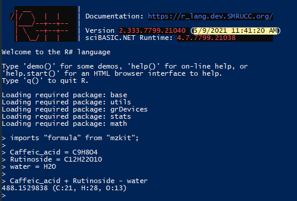

# Symbol Language Feature 

The ``R#`` language contains a feature of symbolic language programming, for example as the mzkit package for ``R#`` system:

There is a chemical formula parser api that provided by mzkit package to ``R#`` system: ``formula::scan``. this ``scan`` api method accept a text data and then parse as chemical formula object, example as:

```R
imports "formula" from "mzkit";

formula::scan("H2O")
# 18.0105642 (H:2, O:1)
```


Sometimes we have the scenario of operation between the chemical formula in R# language, example as the calculate the glycosyl composition in analysis natural product:

```R
imports "formula" from "mzkit";

Caffeic_acid = formula::scan("C9H8O4")
Rutinoside = formula::scan("C12H22O10")
water = formula::scan("H2O")

Caffeic_acid + Rutinoside - water
# 488.1529838 (C:21, H:28, O:13)
```

it is not so convenient for write ``R#`` code with too much function call. So with the symbol language feature in ``R#``, this work could be more easy like:

```R
imports "formula" from "mzkit";

Caffeic_acid = C9H8O4
Rutinoside = C12H22O10
water = H2O

Caffeic_acid + Rutinoside - water
# 488.1529838 (C:21, H:28, O:13)
```



Operation between the symbol language literal is also support:

```R
# Caffeic_acid + Rutinoside - water
C9H8O4 + C12H22O10 - H2O
# 488.1529838 (C:21, H:28, O:13)

toString(C9H8O4 + C12H22O10 - H2O)
# [1] "C21H28O13"
```

## How To

For implements such feature in ``R#`` language, a tag attribute must apply for you exportted api in your .NET code when you develop a package for ``R#`` system, example as:

```vbnet
' https://github.com/xieguigang/mzkit/blame/f44196e49a83fd2e2136ae951868dd154ce7a799/Rscript/Library/mzkit/math/Formula.vb#L157

''' <summary>
''' Get atom composition from a formula string
''' </summary>
''' <param name="formula">The input formula string text.</param>
''' <returns></returns>
<ExportAPI("scan")>
<RSymbolLanguageMask("[a-zA-Z0-9()]+")>
Public Function ScanFormula(formula$, Optional env As Environment = Nothing) As Formula
    Dim n As Integer = env.globalEnvironment.options.getOption("formula.polymers_n", 999)
    Dim formulaObj As Formula = FormulaScanner.ScanFormula(formula, n)

    Return formulaObj
End Function
```

You api method for supports of the symbol language, should accept at least on parameter: the first parameter must be a string text parameter for accept the symbol text. and an environment type parameter in the second position is optional for passing other parameters.

``RSymbolLanguageMask`` attribute is required for tells the ``R#`` interpreter that this method is a kind of interface for handle symbol value literal. 