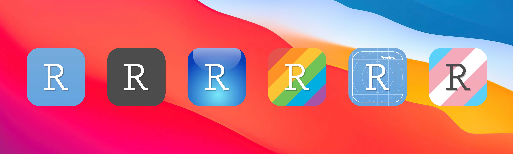

# Alternative Icons for RStudio

These are a set of alternative icons for RStudio, specifically designed to fit macOS Big Sur aesthetic. Their main features are rounded bezels, gentle drop shodows and some gradients. I have tried to keep them as close as possible to the original icons but that's not always the case. In addition to the original icons and their variants listed [here](https://www.rstudio.com/about/logos/), I have designed three extra icons, the Pride, the Trans, and the Preview icons.

Besides the Big Sur icons, you can find a circular and rectangular variants of the icons as well. These might be more suitable for Windows or Linux systems.

  

## Usage

### macOS

1. Navigate to the *Applications* Folder.
2. Right click on the *RStudio.app* and select the *Get Info* menu.
	- Doing so will open a new form that shows some general information about the *RStudio.app* file.
4. Here, select the icon you prefer, and drag-and-drop it over the RStudio logo on **top left** of the Info window.
5. 👉🏼 *If the RStudio is running, you may need to close and reopen it to get your new icon on the Dock.*

**Note:** This is a temporary solution, and after reinstalling or updating the RStudio, you may need to overwrite your icon again.

### Windows

While I specifically designed these icons for macOS, you can still use them on Windows too. Since I do not have a Windows machine and it's been a while that I have worked with them, I cannot tell you how to change your icon. Please Google it! 🔎 I know this much that you need the `.ICO` files, and you can find them in the `Icons/Windows` folder. 

### On Linux

On Linux, you really need to Google it! It is different from distro to distro. As far as I know, on Linux you need to use the PNG file. You can find them in the `Icons/Linux` folder. Good luck! 🍀

**Note:** I recommend to use either the rectangular or round icons on Windows or Linux. I think they are a better fit than the Big Sur icons.

## Contribution

Please let me know if you have noticed any issues with any of the icons. 

## Known Issues

- I would like to use the white 'R' in the Trans flag icon but that's a bit tricky. If you happen to know how to do that nicely, please let me know.

## Support

You can always support my project through GitHub Sponsorship project. Find the 💖 button on top of this page, and either support me monthly, or make a one-time donation. You can also [buy me a coffee](https://ko-fi.com/amirmasoudabdol). I would really appriciate it! 🙂 🙏🏼 